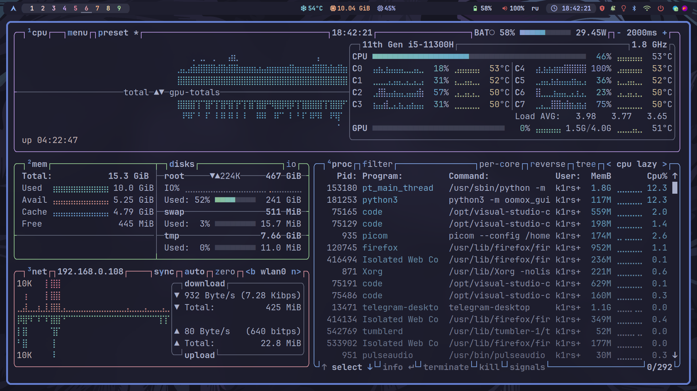

<div align="center">
	
	<h1> Meowrch ≽ܫ≼</h1>
	<a href="https://github.com/meowrch/meowrch/stargazers">
		
	</a>
	<a href="https://github.com/meowrch/meowrch/issues">
		
	</a>
	<a href="./LICENSE">
		
	</a>
	<br>
</div>

<br>
<br>

<!-- INFORMATION -->
<table align="right">
	<tr>
	    <td colspan="2" align="center">System Parameters</td>
	</tr>
	<tr>
	    <th>Component</th>
	    <th>Name</th>
	</tr>
	<tr>
	    <td>OS</td>
	    <td><a href="https://archlinux.org/">Arch Linux</a></td>
	</tr>
	<tr>
	    <td>WM</td>
	    <td><a href="https://github.com/baskerville/bspwm">BSPWM</a></td>
	</tr>
	<tr>
	    <td>Bar</td>
	    <td><a href="https://github.com/polybar/polybar">Polybar</a></td>
	</tr>
	<tr>
	    <td>Compositor</td>
	    <td><a href="https://github.com/yshui/picom">Picom</a></td>
	</tr>
	<tr>
	    <td>Terminal</td>
	    <td><a href="https://github.com/alacritty/alacritty">Alacritty</a></td>
	</tr>
	<tr>
	    <td>App Launcher</td>
	    <td><a href="https://github.com/davatorium/rofi">Rofi</a></td>
	</tr>
	<tr>
	    <td>Notify Daemon</td>
	    <td><a href="https://github.com/dunst-project/dunst">Dunst</a></td>
	</tr>
	<tr>
	    <td>Shell</td>
	    <td><a href="https://github.com/fish-shell/fish-shell">Fish</a></td>
	</tr>
</table>
<div align="left">
	<h3> 📝 О проекте</h2> 
	<p>
	Meowrch - сборка, основанная на Arch, заточенная под максимальную производительность, а также эргономичность.
	</p>
	<h3>🚀 Особенности</h2>
	<p>
	• Система полностью настроена для повседневного комфортногоиспользования.<br>
	• Очень легкая система, потребляющая менее 1Gb RAM.<br>
	• Все горячие клавиши заточены под обеспечение максимальной производительности.<br>
	• Автоматическая установка и настройка всего базового программного обеспечения для разработки. <br>
	• Современный дизайн. <br>
	• Постоянная поддержка проекта.<br>
	</p>
</div>

> [!WARNING]
> ДАННАЯ КОНФИГУРАЦИЯ ПРЕДНАЗНАЧЕНА ДЛЯ МОНИТОРОВ С РАЗРЕШЕНИЕМ 1920X1080,
> НЕКОТОРЫЕ ФУНКЦИИ ОБОЛОЧКИ МОГУТ РАБОТАТЬ НЕПРАВИЛЬНО.
> В ЭТОМ СЛУЧАЕ ВАМ НЕОБХОДИМО ВНЕСТИ ИЗМЕНЕНИЯ ВРУЧНУЮ.
> ЕСЛИ ВЫ ОБНАРУЖИТЕ ОШИБКИ В ОБОЛОЧКЕ, ПОЖАЛУЙСТА, СООБЩИТЕ О ПРОБЛЕМЕ.

<!-- IMAGES -->
<details close> <summary><h3>🖼️ Мини-обзор</h3></summary>
	
	
	
	
	
	
</details>

<!-- INSTALLATION -->
## 🛠 Установка
Если у вас уже установлен Linux Arch, то выполняем следующие действия:
1. Устанавливаем базовые пакеты
   ```
    sudo pacman -Sy
    sudo pacman -S xorg bspwm sxhkd xorg-xinit xterm git python3
    ```
2. Загрузим репозиторий и начнем процесс установки. В одном из этапов билдера вам будет предложено установить `DEV_PACKAGES`, они не нужны для системы, но могут быть полезны для разработки. Выбирайте пункты на свое усмотрение.
   ```
   git clone https://github.com/meowrch/meowrch.git
   cd meowrch
   python3 Builder/install.py
   ```
3. Если вы сделали всё правильно, то уже можно начать пользоваться сборкой. `startx`

<!-- ERRORS -->
## 🩹 Исправление ошибок после установки
* **Яркость экрана не отображается на панели**. Эта ошибка связана с тем, что билдеру не удалось автоматически установить драйверы для видеокарты или процессора. Вам необходимо перейти на [Arch Wiki](https://wiki.archlinux.org) и выполнить установку вручную.
* **Зависает анимация или терминалы**. Проблема в том, что вы, возможно, не используете графические драйверы или работаете с виртуальной машины. Вам нужно открыть "~/.config/bspwm/bspwmrc" и закомментировать строку с запуском `picom`.
* **Проблема с интерфейсом**. Если вы не используете монитор с разрешением 1920x1080, интерфейс может выглядеть не так, как должен выглядеть. В этом случае вам необходимо вручную отредактировать конфигурацию.
* **Другие ошибки**. Если вы обнаружили ошибки, которых здесь нет, и уверены, что следовали инструкциям, обязательно свяжитесь с нами, чтобы мы могли исправить ошибку в следующем обновлении.

<h2>💻 HotKeys</h2>
<table align="center">
	<tr>
		<td colspan="2" align="center">Сочетания клавиш</td>
	</tr>
    <tr>
        <th>Название действия</th>
        <th>Горячая клавиша</th>
    </tr>
    <tr>
        <td>Открыть терминал</td>
        <td>super + enter</td>
    </tr>
    <tr>
        <td>Сменить раскладку</td>
        <td>shift + alt</td>
    </tr>
    <tr>
        <td>Открыть меню приложений</td>
        <td>super + d</td>
    </tr>
    <tr>
        <td>Завершить сеанс</td>
        <td>super + x</td>
    </tr>
    <tr>
        <td>Распознать цвет на экране</td>
        <td>super + c</td>
    </tr>
    <tr>
        <td>Заблокировать экран</td>
        <td>super + l</td>
    </tr>
    <tr>
        <td>Открыть календарь</td>
        <td>super + k</td>
    </tr>
    <tr>
        <td>Запустить Firefox</td>
        <td>super + shift + f</td>
    </tr>
    <tr>
        <td>Закрыть активное окно</td>
        <td>super + q</td>
    </tr>
    <tr>
        <td>Сделать скриншот</td>
        <td>print</td>
    </tr>
    <tr>
        <td>Перезапустить BSPWM</td>
        <td>ctrl + shift + r</td>
    </tr>
    <tr>
        <td>Переключиться на другую рабочую область</td>
        <td>super + 1/9</td>
    </tr>
    <tr>
        <td>Перенести активное окно на другую рабочую область</td>
        <td>super + shift + 1/9</td>
    </tr>
    <tr>
        <td>Перевести активное окно в плавающий режим</td>
        <td>super + space</td>
    </tr>
	<tr>
		<td colspan="2" align="center">Остальная конфигурация находится в `~/.config/sxhkd/sxhkdrc`</td>
	</tr>
</table>

***

Проект активно развивается, поэтому вы можете предложить свои идеи по улучшению. 
Если остались вопросы, - добро пожаловать в телеграм: `@dimflix_official`
