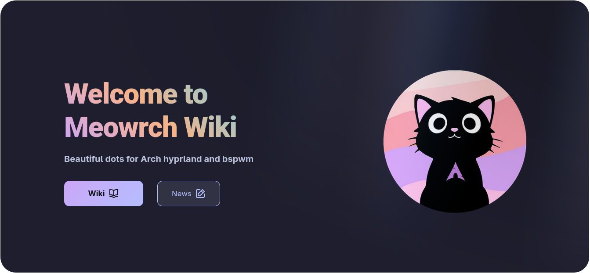
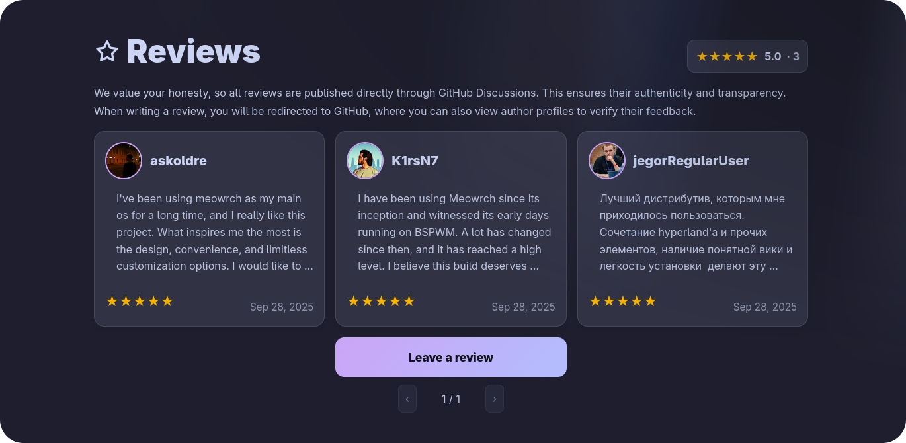

<div align="center">


# ≽ܫ≼ Meowrch

### *Arch Linux. Evolved.*
**Where performance meets aesthetics**

<br>

[](https://github.com/meowrch/meowrch/issues)
[](https://github.com/meowrch/meowrch/stargazers)
[](./LICENSE)


[](./README.ru.md)
[](./README.md)

<br>

[🚀 Quick Start](#-installation) • [📸 Gallery](#-visual-presentation) • [⚡ Features](#-why-meowrch) • [📖 Wiki](https://meowrch.github.io/en/) • [💬 Community](https://t.me/meowrch)

</div>

---

## 🎯 Why Another Rice?

**Most ready-made rice setups for Arch solve only one problem:**

- 🎨 Either **beauty**, but the system eats RAM.
- ⚡ Or **performance**, but the UI looks ugly.
- 🛠️ Or **functionality**, but the code turns into "spaghetti" that you can't fix yourself.

### **Meowrch is a different approach:**

We don't sacrifice one for the other. Instead, we create a system where each component is chosen based on the principle of **"maximum results with minimum resources"**.

**But most importantly** — we don't limit ourselves to beautiful configs.

We create **our own tools** that solve **long-standing pain points of the entire Linux community**:
<table> 
  <tr> 
  <td>
🏷️ Nemo Tags

For 10+ years the community requested a tagging system for Nemo.
Developers ignored it. We made it.

Now file organization like in macOS Finder is available to everyone.
  </td> 
  </tr>
  <tr> 
  <td>
🩸 BlueVein

Dual-boot Windows/Linux = Bluetooth hell.
Switched OS? Reconnect your mouse, keyboard, headphones.
**Every. Single. Time.**

We solved this agonizing problem.
  </td> 
  </tr> 
</table>

> [!NOTE]
> **All our tools are open-source** and work not only in Meowrch. \
> We develop an ecosystem **for the entire Linux community**, not just "making it pretty for ourselves".

---

## 🌟 Why Meowrch?

<div align="center">

| 💎 Feature | 🔥 What it gives you |
|:---:|:---|
| **🚀 Optimization** | The system has the best optimizations from [ARU](https://github.com/ventureoo/ARU) and [CachyOS](https://cachyos.org/). [More details](https://meowrch.github.io/en/optimization/performance-advantages/) |
| **🎨 Community [theme store](https://github.com/meowrch/pawlette-themes)** | Change the appearance of the entire system **with one command** |
| **📦 Open-source development** | We support Linux development by creating our own components, **useful for the global Linux community**. [**More details here**](https://github.com/meowrch/) |
| **🛠️ Automation** | Installation **in 10 minutes**, complete setup and optimization — **without manual config editing** |
| **🎯 Ergonomics** | Hotkeys are thought out **down to the smallest detail** — work faster |
| **🌊 Two environments** | BSPWM (X11) or Hyprland (Wayland) — **stability or modernity** |
| **🪶 Lightweight** |  **1 GB RAM** at system startup — thanks to [lightweight components](https://meowrch.github.io/en/introduction/сomponent-selection-philosophy/) |
</div>

---

## 📸 Visual Presentation

<table align="center">
  <tr>
    <td colspan="3">
        <a href="https://youtu.be/KdGPDF4p5CA">
            
        </a>
    </td>
  </tr>
  <tr>
    <td></td>
    <td></td>
    <td></td>
  </tr>
  <tr>
    <td></td>
    <td></td>
    <td></td>
  </tr>
</table>

---

## 🏝️ Meet Mewline — Dynamic Island for Linux

### **Compact interface, maximum information:**

- 🖥️ **System tray** — all your background applications
- 🗂️ **Workspaces** — quick switching between desktops
- 📅 **Date & Time** — always visible
- 🔆 **Brightness** — screen brightness control
- 🔊 **Volume** — sound control
- 🔋 **Battery** — charge and charging status
- ⚡ **Power** — power management menu
- 📸 **OCR** — text recognition from selected screen area.

### **Interactive system control center:**

- 🎵 **Compact mode** — information about active window and playing music
- 🔔 **Information menu** — calendar and notification history (Super+Alt+D)
- 🚀 **App launcher** — application launcher (Super+Alt+A)
- 🖼️ **Wallpapers** — wallpaper change with preview (Super+Alt+W)
- 😊 **Emoji picker** — emoji selection (Super+Alt+.)
- 📋 **Clipboard** — clipboard history (Super+Alt+V)
- 🌐 **Network manager** — Wi-Fi and Ethernet (Super+Alt+N)
- 🖥️ **Workspaces** — windows and workspaces manager (Super+Alt+Tab)
- 🔵 **Bluetooth** — device management (Super+Alt+B)

> [!NOTE]
> Yes-yes. **All this is in one utility**. \
> Instead of configuring Rofi + Waybar + Dunst + wlogout + network-manager-applet + clipboard manager — **one installation command**.


<div align="center">

**[📖 Full Mewline documentation](https://github.com/meowrch/mewline)** -  **[🐛 Report an issue](https://github.com/meowrch/mewline/issues)**

</div>

---

## 🛠️ Installation

> [!WARNING] 
> The installer is designed for **clean Arch Linux**. \
> If you already have a configured system, installation **will overwrite** configurations. \
> For testing, create a new user. \
> If you like it — switch to Meowrch completely

### 📦 Quick Start

```
# 1. Clone the repository
git clone https://github.com/meowrch/meowrch --depth 1 --single-branch
cd meowrch

# 2. Run the installer
sh install.sh

# 3. Reboot
reboot
```

---

## 📋 What do you get after installation?

<table align="center">
<tr>
<th width="30%">Component</th>
<th width="70%">Details</th>
</tr>
<tr>
<td><b>🐧 Base OS</b></td>
<td><a href="https://archlinux.org/">Arch Linux</a> + <a href="https://meowrch.github.io/en/optimization/performance-advantages/">aggressive optimization</a>
</tr>
<tr>
<td><b>🪟 Window Managers</b></td>
<td><a href="https://github.com/baskerville/bspwm">BSPWM</a> (X11) | <a href="https://hyprland.org/">Hyprland</a> (Wayland)</td>
</tr>
<tr>
<td><b>📊 Panels</b></td>
<td><a href="https://github.com/polybar/polybar">Polybar</a> | <a href="https://github.com/Alexays/Waybar">Waybar</a> | <a href="https://github.com/meowrch/mewline">Mewline</a></td>
</tr>
<tr>
<td><b>🎨 Customization</b></td>
<td><a href="https://github.com/meowrch/pawlette">Pawlette</a> with preinstalled Catppuccin Mocha theme</td>
</tr>
<tr>
<td><b>🖥️ Terminal</b></td>
<td><a href="https://github.com/kovidgoyal/kitty">Kitty</a></td>
</tr>
<tr>
<td><b>🐚 Shells</b></td>
<td><a href="https://github.com/fish-shell/fish-shell">Fish</a> | <a href="https://www.zsh.org">Zsh</a></td>
</tr>
<tr>
<td><b>🎯 Menus and Widgets</b></td>
<td><a href="https://github.com/davatorium/rofi">Rofi</a> | <a href="https://github.com/meowrch/mewline">Mewline</a></td>
</tr>
<tr>
<td><b>🔔 Notifications</b></td>
<td><a href="https://github.com/dunst-project/dunst">Dunst</a> | <a href="https://github.com/ErikReider/SwayNotificationCenter">Swaync</a> | <a href="https://github.com/meowrch/mewline">Mewline</a></td>
</tr>
<tr>
<td><b>📦 Repositories</b></td>
<td><a href="https://wiki.archlinux.org/title/Official_repositories">Arch Official</a> + <a href="https://aur.chaotic.cx/">Chaotic AUR</a></td>
</tr>
</table>

> [!NOTE]
> **Why these components?**
> We chose between performance, functionality, and stability.
> [More about component selection](https://meowrch.github.io/en/introduction/сomponent-selection-philosophy/)

---

## ⌨️ Hotkeys

| Action                | Combination    | Why is it convenient?                                                                               |
| --------------------- | -------------- | --------------------------------------------------------------------------------------------------- |
| Open terminal         | Super + Enter  | Quick access to a universal tool.                                                                   |
| Application selection | Super + A      | Convenient way to select the needed application.                                                    |
| Color picker          | Super + C      | Recognize color from screen for design/development.                                                 |
| Change wallpaper      | Super + W      | Rofi with preview. One button — new desktop look.                                                   |
| Change theme          | Super + T      | New theme in 2 seconds. Without editing configs.                                                    |
| Emoji                 | Super + .      | Like in Windows 11, but faster.                                                                     |
| Disable hotkeys       | Super + Escape | Can help when using virtual machines on Meowrch with configurations that also work through hotkeys. |


> [!TIP]
> **All available hotkeys** can be found [**here**](https://meowrch.github.io/en/usage/hotkeys/#meowrch-hotkeys).

---

## 💬 Support and Community

<div align="center">

<a href="https://meowrch.github.io/">

</a>

**[🌐 Official Wiki](https://meowrch.github.io/)** — guides, FAQ, troubleshooting

<br>

### 💬 Join the Community

<table align="center">
<tr>
<td align="center" width="33%">
<h3>📢 Telegram</h3>
<a href="https://t.me/meowrch">

</a>
<br><br>
News, updates and <a href="https://t.me/meowrch/7">quick support</a>
</td>
<td align="center" width="33%">
<h3>🐛 Issues</h3>
<a href="https://github.com/meowrch/meowrch/issues">

</a>
<br><br>
Report a bug or suggest a feature
</td>
<td align="center" width="33%">
<h3>⭐ Reviews</h3>
<a href="https://meowrch.github.io/en/#reviews">

</a>
<br><br>
Share your impressions about the distribution
</td>
</tr>
</table>

</div>

---

## ⭐ What Users Say?

<div align="center">

<a href="https://meowrch.github.io/en/#reviews">

</a>
<br>
<br>
</div>


> [!IMPORTANT] 
> **📢 Your review matters!** \
>  Share your experience on **[website](https://meowrch.github.io/en/#reviews)**

---

## ☕ Support the Project

<div align="center">

**Like Meowrch?** Help the project development! 🚀

| 💎 Cryptocurrency | 📬 Address |
|:---:|:---|
| **TON** | `UQB9qNTcAazAbFoeobeDPMML9MG73DUCAFTpVanQnLk3BHg3` |
| **Ethereum** | `0x56e8bf8Ec07b6F2d6aEdA7Bd8814DB5A72164b13` |
| **Bitcoin** | `bc1qt5urnw7esunf0v7e9az0jhatxrdd0smem98gdn` |
| **Tron** | `TBTZ5RRMfGQQ8Vpf8i5N8DZhNxSum2rzAs` |

<br>

*Every donation motivates to continue developing the project! ❤️*

</div>

---

## 📊 Project Statistics


### ⭐ Star History

<a href="https://star-history.com/#meowrch/meowrch&Date">
<picture>
<source media="(prefers-color-scheme: dark)" srcset="https://api.star-history.com/svg?repos=meowrch/meowrch&type=Date&theme=dark" />
<source media="(prefers-color-scheme: light)" srcset="https://api.star-history.com/svg?repos=meowrch/meowrch&type=Date" />

</picture>
</a>

### 📈 Repository Activity


---

<div align="center">

**Made with ❤️ for the Linux community**

</div>
