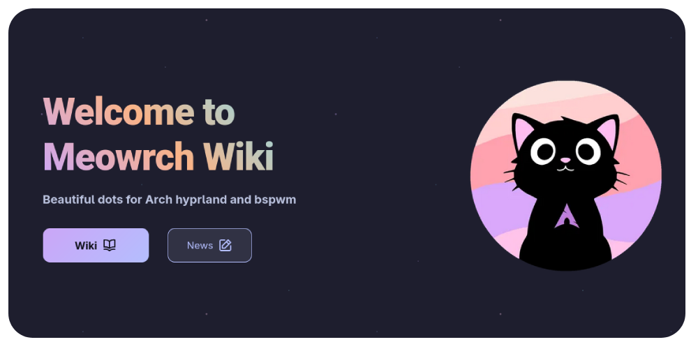
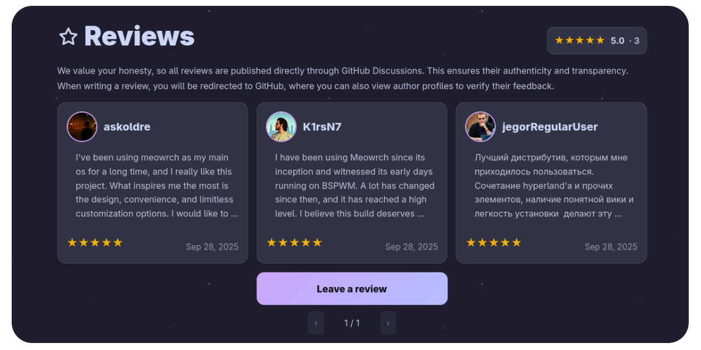

<div align="center">
	
	<h1> Meowrch ≽ܫ≼</h1>
	<a href="https://github.com/meowrch/meowrch/issues">
		
	</a>
	<a href="https://github.com/meowrch/meowrch/stargazers">
		
	</a>
	<a href="./LICENSE">
		
	</a>
	<br>
	<br>
	<a href="./README.ru.md">
		
	</a>
	<a href="./README.md">
		
	</a>
</div>

***

<br>
<a href="https://youtu.be/KdGPDF4p5CA"></a>
<br>
<br>
<br>

<!-- INFORMATION -->
<table align="right">
	<tr>
	    <td colspan="2" align="center">System Specifications</td>
	</tr>
	<tr>
	    <th>Component</th>
	    <th>Name</th>
	</tr>
	<tr>
	    <td>OS</td>
	    <td><a href="https://archlinux.org/">Arch Linux</a></td>
	</tr>
	<tr>
	    <td>WM</td>
	    <td><a href="https://github.com/baskerville/bspwm">BSPWM</a> | <a href="https://hyprland.org/">Hyprland</a></td>
	</tr>
	<tr>
	    <td>Bar</td>
	    <td><a href="https://github.com/polybar/polybar">Polybar</a> | <a href="https://github.com/Alexays/Waybar">Waybar</a> + <a href="https://github.com/meowrch/mewline">Mewline</a></td>
	</tr>
	<tr>
	    <td>Compositor</td>
	    <td><a href="https://github.com/yshui/picom">Picom</a> | Built-in</td>
	</tr>
	<tr>
	    <td>Terminal</td>
	    <td><a href="https://github.com/kovidgoyal/kitty">Kitty</a></td>
	</tr>
	<tr>
	    <td>Widgets</td>
	    <td><a href="https://github.com/davatorium/rofi">Rofi</a> | <a href="https://github.com/meowrch/mewline">Mewline</a></td>
	</tr>
	<tr>
	    <td>Notify Daemon</td>
	    <td><a href="https://github.com/dunst-project/dunst">Dunst</a> | <a href="https://github.com/ErikReider/SwayNotificationCenter">Swaync</a></td>
	</tr>
	<tr>
	    <td>Shell</td>
	    <td><a href="https://github.com/fish-shell/fish-shell">Fish</a> | <a href="https://www.zsh.org">Zsh</a></td>
	</tr>
</table>
<div align="left">
	<h3> 📝 About the Project</h2> 
	<p>
	Meowrch is a distribution based on Arch, optimized for maximum performance, ergonomics, and aesthetics.
	</p>
	<h3>🚀 Features</h2>
	<p>
	• Automatic system installation and configuration.<br>
	• Deep system optimization at the level of <b><a src="https://cachyos.org/">CachyOS</a></b> <br>
	• Extensive customization capabilities and <b><a href="https://github.com/meowrch/pawlette-themes">official theme store</a></b><br>
	• Hotkeys are optimized to ensure maximum productivity.<br>
	• Support for <b><a src="https://aur.chaotic.cx/">Chaotic AUR</a></b> for faster installation of popular packages.<br>
	• Continuous and reliable support to ensure successful project operation<br>
	</p>
</div>

<!-- IMAGES -->
<h2>🌌 Visual Overview</h2>
<table align="center">
  <tr>
    <td colspan="4"></td>
  </tr>
  <tr>
    <td colspan="1"></td>
    <td colspan="1"></td>
    <td colspan="1"></td>
  </tr>
  <tr>
	<td colspan="1"></td>
	<td colspan="1"></td>
	<td colspan="1"></td>
  </tr>
</table>


<!-- INSTALLATION -->
## 🛠 Installation
If you already have Arch Linux installed, follow these steps:
### 1. Clone the repository
```
git clone --recurse-submodules --depth 1 https://github.com/meowrch/meowrch
```
### 2. Navigate to the project directory
```
cd meowrch
```
### 3. Run the automatic installation
```
sh install.sh
```

> [!important]
> After installation, you **must** reboot to apply the changes.

> [!note]
> Instructions for navigating the installer menu: \
> • Select a menu item: Press Space to select the desired item. \
> • Proceed to the next step: Press Enter to move to the next step.

<h2>💻 Support</h2>

<a href="https://meowrch.github.io/">
	
</a>

If you have questions or need help with the project, please visit our <a href="https://meowrch.github.io/">Wiki</a>. Here you will find useful guides and information that will help you better understand how to use our product.<br><br>
If you encounter errors or problems that are not covered in our <a href="https://meowrch.github.io/">Wiki</a>, feel free to report them in the <a href="https://github.com/meowrch/meowrch/issues">Issues</a> section. 
<br><br>
We also invite you to visit our <a href="https://t.me/meowrch">Telegram</a>, where you can find <a href="https://t.me/meowrch/9">news</a> and <a href="https://t.me/meowrch/7">quick support</a>.
<br><br>

<h2>💻 Hotkeys</h2>

<h3 align="center">System Shortcuts</h3>
<table align="center">
    <tr>
        <th>Action</th>
        <th>Hyprland</th>
		<th>Bspwm</th>
    </tr>
	<tr>
        <td>Open terminal</td>
		<td colspan="2" align="center">super + enter</td>
    </tr>
    <tr>
        <td>Open file manager</td>
		<td colspan="2" align="center">super + e</td>
    </tr>
	<tr>
        <td>Open application menu</td>
		<td colspan="2" align="center">super + d</td>
    </tr>
     <tr>
        <td>Open power menu</td>
		<td colspan="2" align="center">super + x</td>
    </tr>
	<tr>
        <td>Open emoji picker</td>
		<td colspan="2" align="center">super + .</td>
    </tr>
	<tr>
        <td>Take a screenshot</td>
		<td colspan="2" align="center">PrintScreen</td>
    </tr>
	<tr>
        <td>Take a full screenshot</td>
		<td colspan="2" align="center">super + PrintScreen</td>
    </tr>
	<tr>
        <td>Change wallpaper</td>
		<td colspan="2" align="center">super + w</td>
    </tr>
	<tr>
        <td>Change theme</td>
		<td colspan="2" align="center">super + t</td>
    </tr>
	<tr>
        <td>Switch keyboard layout</td>
		<td colspan="2" align="center">alt + shift</td>
    </tr>
     <tr>
        <td>Pick color from screen</td>
		<td colspan="2" align="center">super + c</td>
    </tr>
     <tr>
        <td>Lock screen</td>
        <td colspan="2" align="center">super + l</td>
    </tr>
	<tr>
        <td>Open task manager (btop)</td>
		<td colspan="2" align="center">ctrl + shift + esc</td>
    </tr>
	<tr>
        <td>Pin window</td>
		<td colspan="2" align="center">super + p</td>
    </tr>
	<tr>
        <td>Clipboard manager</td>
		<td colspan="2" align="center">super + v</td>
    </tr>
	<tr>
        <td>Toggle bar</td>
		<td colspan="2" align="center">super + b</td>
    </tr>
	<tr>
        <td>Switch bar to mewline/waybar</td>
		<td>super + shift + b</td>
		<td>N/A</td>
    </tr>
</table>

<h3 align="center">Window and Workspace Management</h3>
<table align="center">
    <tr>
        <th>Action</th>
        <th>Hyprland</th>
		<th>Bspwm</th>
    </tr>
	<tr>
        <td>Switch to another workspace</td>
		<td>super + 1-9</td>
		<td>super + 1-9</td>
    </tr>
	<tr>
        <td>Switch to next workspace</td>
		<td>super + ctrl + right</td>
		<td>super + ctrl + right</td>
    </tr>
	<tr>
        <td>Switch to previous workspace</td>
		<td>super + ctrl + left</td>
		<td>super + ctrl + left</td>
    </tr>
	<tr>
        <td>Switch to first empty workspace</td>
		<td>super + ctrl + down</td>
		<td>super + ctrl + down</td>
    </tr>
	<tr>
        <td>Scroll workspaces forward</td>
		<td>super + mouse_down</td>
		<td>super + mouse_down</td>
    </tr>
	<tr>
        <td>Scroll workspaces backward</td>
		<td>super + mouse_up</td>
		<td>super + mouse_up</td>
    </tr>
	<tr>
        <td>Switch to special workspace</td>
		<td>super + s</td>
		<td>N/A</td>
    </tr>
     <tr>
        <td>Move active window to another workspace</td>
		<td>super + shift + 1-9</td>
		<td>super + shift + 1-9</td>
    </tr>
     <tr>
        <td>Toggle active window to floating mode</td>
		<td colspan="2" align="center">super + space</td>
    </tr>
	<tr>
        <td>Toggle active window to fullscreen mode</td>
		<td colspan="2" align="center">alt + enter</td>
    </tr>
    <tr>
        <td>Close active window</td>
		<td colspan="2" align="center">super + q</td>
    </tr>
	<tr>
        <td>Kill active window</td>
		<td colspan="2" align="center">super + k</td>
    </tr>
     <tr>
        <td>Move window focus</td>
		<td colspan="2" align="center">super + arrow keys</td>
    </tr>
	<tr>
        <td>Resize window</td>
		<td colspan="2" align="center">super + shift + arrow keys</td>
    </tr>
	<tr>
        <td>Move window</td>
		<td colspan="2" align="center">super + shift + ctrl + arrow keys</td>
    </tr>
</table>

<h3 align="center">Launch Applications</h3>
<table align="center">
    <tr>
        <th>Action</th>
        <th>Hyprland</th>
		<th>Bspwm</th>
    </tr>
	<tr>
        <td>Open Firefox</td>
		<td colspan="2" align="center">super + shift + f</td>
    </tr>
	<tr>
        <td>Open VSCode</td>
		<td colspan="2" align="center">super + shift + c</td>
    </tr>
	<tr>
        <td>Open Telegram</td>
		<td colspan="2" align="center">super + shift + t</td>
    </tr>
	<tr>
        <td>Open Obsidian</td>
		<td colspan="2" align="center">super + shift + o</td>
    </tr>
	<tr>
        <td>Open pavucontrol</td>
		<td colspan="2" align="center">super + shift + p</td>
    </tr>
</table>

<h3 align="center">System Control</h3>
<table align="center">
    <tr>
        <th>Action</th>
        <th>Hyprland</th>
		<th>Bspwm</th>
    </tr>
	<tr>
        <td>Exit session</td>
		<td colspan="2" align="center">super + delete</td>
    </tr>
    <tr>
        <td>Restart window manager</td>
		<td colspan="2" align="center">ctrl + shift + r</td>
    </tr>
	<tr>
        <td>Disable/Enable hotkey tracking</td>
		<td colspan="2" align="center">super + escape</td>
    </tr>
</table>

## ⭐ Reviews
<a href="https://meowrch.github.io/en/#reviews">
	
</a>

We value **your opinion** and would be happy if you share your experience using **Meowrch**. Your reviews help us make the project better and inspire us to new achievements.

You can see what other users are saying and leave your review on **[our website](https://meowrch.github.io/en/#reviews)**, or directly on **[GitHub](https://github.com/meowrch/meowrch/discussions/categories/reviews)**.


## ☕ Support the Project
If you want to support my work, you can send a donation to the following cryptocurrency wallets:

| Cryptocurrency | Address                                        	|
| -------------- | -------------------------------------------------- |
| **TON**        | `UQB9qNTcAazAbFoeobeDPMML9MG73DUCAFTpVanQnLk3BHg3` |
| **Ethereum**   | `0x56e8bf8Ec07b6F2d6aEdA7Bd8814DB5A72164b13`       |
| **Bitcoin**    | `bc1qt5urnw7esunf0v7e9az0jhatxrdd0smem98gdn`       |
| **Tron**       | `TBTZ5RRMfGQQ8Vpf8i5N8DZhNxSum2rzAs`               |

## 📊 Statistics
<a href="https://star-history.com/#meowrch/meowrch&Date">
 <picture>
   <source media="(prefers-color-scheme: dark)" srcset="https://api.star-history.com/svg?repos=meowrch/meowrch&type=Date&theme=dark" />
   <source media="(prefers-color-scheme: light)" srcset="https://api.star-history.com/svg?repos=meowrch/meowrch&type=Date" />
   
 </picture>
</a>

