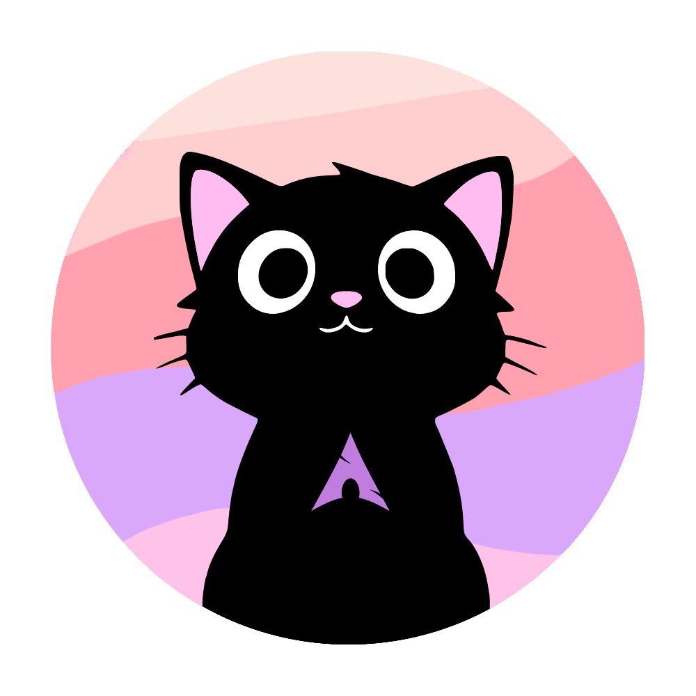
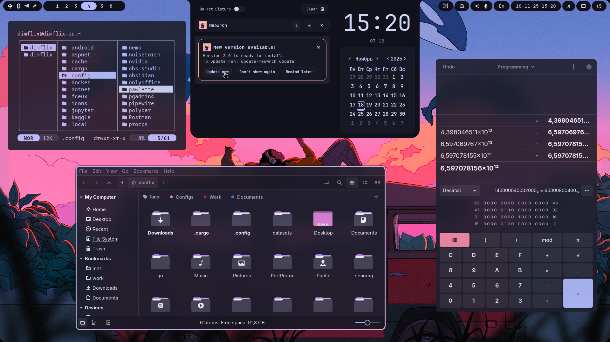
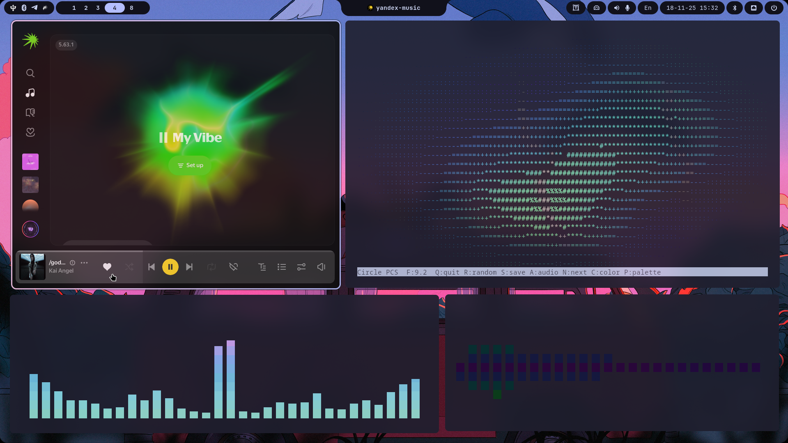
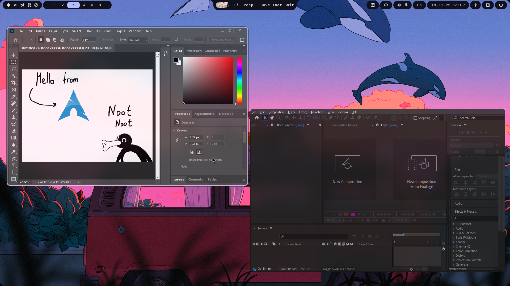
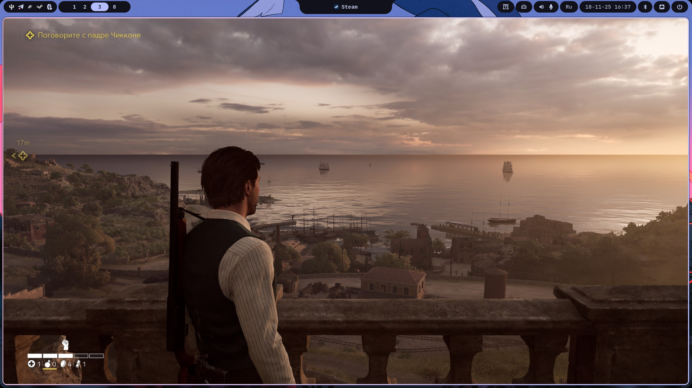
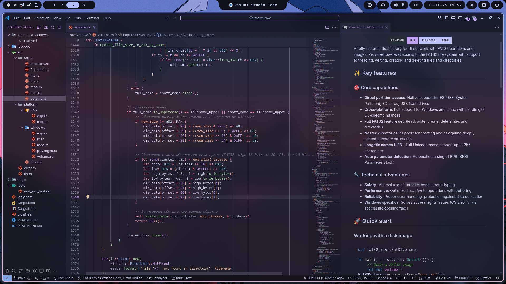
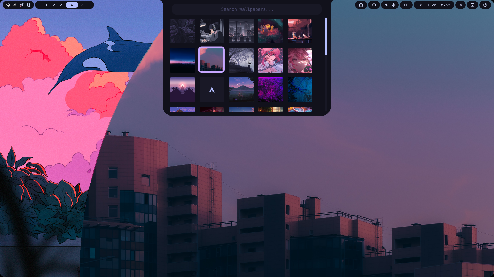
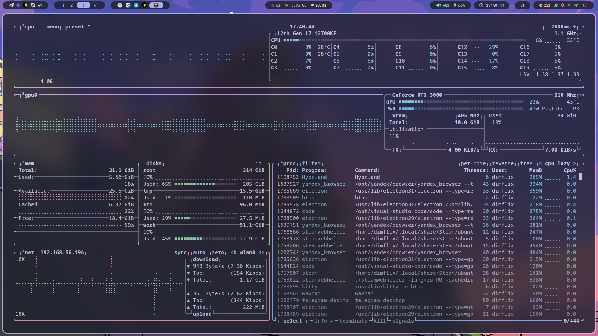

<div align="center">
	
	<h1> Meowrch ≽ܫ≼</h1>
	<a href="https://github.com/meowrch/meowrch/issues">
		
	</a>
	<a href="https://github.com/meowrch/meowrch/stargazers">
		
	</a>
	<a href="./LICENSE">
		
	</a>
	<br>
	<br>
	<a href="./README.ru.md">
		
	</a>
	<a href="./README.md">
		
	</a>
</div>

***

<br>
<a href="https://youtu.be/KdGPDF4p5CA"></a>

<!-- INFORMATION -->
<table align="right">
	<tr>
	    <td colspan="2" align="center">Системные параметры</td>
	</tr>
	<tr>
	    <th>Компонент</th>
	    <th>Название</th>
	</tr>
	<tr>
	    <td>OS</td>
	    <td><a href="https://archlinux.org/">Arch Linux</a></td>
	</tr>
	<tr>
	    <td>WM</td>
	    <td><a href="https://github.com/baskerville/bspwm">BSPWM</a> | <a href="https://hyprland.org/">Hyprland</a></td>
	</tr>
	<tr>
	    <td>Bar</td>
	    <td><a href="https://github.com/polybar/polybar">Polybar</a> | <a href="https://github.com/Alexays/Waybar">Waybar</a></td>
	</tr>
	<tr>
	    <td>Compositor</td>
	    <td><a href="https://github.com/yshui/picom">Picom</a> | Built-in</td>
	</tr>
	<tr>
	    <td>Terminal</td>
	    <td><a href="https://github.com/kovidgoyal/kitty">Kitty</a></td>
	</tr>
	<tr>
	    <td>App Launcher</td>
	    <td><a href="https://github.com/davatorium/rofi">Rofi</a></td>
	</tr>
	<tr>
	    <td>Notify Daemon</td>
	    <td><a href="https://github.com/dunst-project/dunst">Dunst</a></td>
	</tr>
	<tr>
	    <td>Shell</td>
	    <td><a href="https://github.com/fish-shell/fish-shell">Fish</a></td>
	</tr>
</table>
<div align="left">
	<h3> 📝 О проекте</h2> 
	<p>
	Meowrch - сборка, основанная на Arch, заточенная под максимальную производительность, эргономичность и красоту.
	</p>
	<h3>🚀 Особенности</h2>
	<p>
	• Система полностью настроена для повседневного комфортного использования.<br>
	• Широкие возможности кастомизации и <a href="https://github.com/meowrch/meowrch-themes">пользовательский магазин тем</a><br>
	• Горячие клавиши заточены под обеспечение максимальной производительности.<br>
	• Автоматическая установка и настройка системы. <br>
	• Современный дизайн. <br>
	• Обеспечение непрерывной и надежной поддержки для успешного функционирования проекта<br>
	</p>
</div>

> [!WARNING]
> ДАННАЯ КОНФИГУРАЦИЯ ПРЕДНАЗНАЧЕНА ДЛЯ МОНИТОРОВ С РАЗРЕШЕНИЕМ 1920X1080,
> НЕКОТОРЫЕ ФУНКЦИИ ОБОЛОЧКИ МОГУТ РАБОТАТЬ НЕПРАВИЛЬНО.
> В ЭТОМ СЛУЧАЕ ВАМ НЕОБХОДИМО ВНЕСТИ ИЗМЕНЕНИЯ ВРУЧНУЮ.
> ЕСЛИ ВЫ ОБНАРУЖИТЕ ОШИБКИ В ОБОЛОЧКЕ, ПОЖАЛУЙСТА, СООБЩИТЕ О ПРОБЛЕМЕ.


<!-- IMAGES -->
<table align="center">
  <tr>
    <td colspan="4"></td>
  </tr>
  <tr>
    <td colspan="1"></td>
    <td colspan="1"></td>
    <td colspan="1"></td>
  </tr>
  <tr>
	<td colspan="1"></td>
	<td colspan="1"></td>
	<td colspan="1"></td>
  </tr>
</table>


<!-- INSTALLATION -->
## 🛠 Установка
Если у вас уже установлен Linux Arch, то выполняем следующие действия:
### 1. Клонируем репозиторий
```
git clone https://github.com/meowrch/meowrch.git
```
### 2. Переходим в каталог с проектом
```
cd meowrch
```
### 3. Запускаем автоматическую установку
```
sh install.sh
```

> [!important]
> После установки вам нужно **обязательно** перезагрузиться для применения изменений.


> [!note]
> Инструкции по навигации в меню установщика: \
> • Выбор элемента в меню: Для выбора нужного элемента нажмите Пробел. \
> • Переход к следующему шагу: Чтобы перейти к следующему шагу, нажмите Enter.

<h2>💻 Помощь</h2>
Если у вас возникли вопросы или вам нужна помощь с проектом, пожалуйста, посетите нашу <a href="https://github.com/meowrch/meowrch/wiki">Wiki</a>. Здесь вы найдете полезные руководства и информацию, которая поможет вам лучше понять, как использовать наш продукт.<br><br>
Если вы столкнулись с ошибками или проблемами, которых нет на нашей <a href="https://github.com/meowrch/meowrch/wiki">Wiki</a>, не стесняйтесь сообщить об этом в разделе <a href="https://github.com/meowrch/meowrch/issues">Issues</a>. 
<br><br>
Так-же предлагаем посетить наш <a href="https://t.me/meowrch">Telegram</a>, в котором вы найдёте <a href="https://t.me/meowrch/9">новости</a>, <a href="https://t.me/meowrch/22">отзывы</a> и <a href="https://t.me/meowrch/7">быструю поддержку</a>.
<br><br>
Ваши отзывы помогут нам улучшить проект и сделать его еще более удобным для пользователей.


<h2>💻 Горячие клавиши</h2>
<table align="center">
	<tr>
		<td colspan="3" align="center">Сочетания клавиш</td>
	</tr>
    <tr>
        <th>Название действия</th>
        <th>Hyprland</th>
		<th>Bspwm</th>
    </tr>
	<tr>
        <td>Открыть терминал</td>
		<td colspan="2" align="center">super + enter</td>
    </tr>
    <tr>
        <td>Открыть меню приложений</td>
		<td colspan="2" align="center">super + d</td>
    </tr>
	<tr>
        <td>Открыть файловый менеджер</td>
		<td colspan="2" align="center">super + e</td>
    </tr>
	<tr>
        <td>Открыть Firefox</td>
		<td colspan="2" align="center">super + shift + f</td>
    </tr>
	<tr>
        <td>Открыть VSCode</td>
		<td colspan="2" align="center">super + shift + c</td>
    </tr>
	<tr>
        <td>Открыть диспетчер задач (btop)</td>
		<td colspan="2" align="center">ctrl + shift + esc</td>
    </tr>
	<tr>
        <td>Открыть выбор емоджи</td>
		<td colspan="2" align="center">super + .</td>
    </tr>
    <tr>
        <td>Открыть меню включения / выключения компьютера</td>
		<td colspan="2" align="center">super + x</td>
    </tr>
	<tr>
        <td>Сделать скриншот</td>
		<td colspan="2" align="center">PrintScreen</td>
    </tr>
	<tr>
        <td>Сменить обои</td>
		<td colspan="2" align="center">super + w</td>
    </tr>
	<tr>
        <td>Сменить тему</td>
		<td colspan="2" align="center">super + t</td>
    </tr>
	<tr>
        <td>Сменить раскладку</td>
		<td colspan="2" align="center">shift + alt</td>
    </tr>
    <tr>
        <td>Распознать цвет на экране</td>
		<td colspan="2" align="center">super + c</td>
    </tr>
    <tr>
        <td>Заблокировать экран</td>
        <td colspan="2" align="center">super + l</td>
    </tr>
	<tr>
        <td>Переключиться на другую рабочую область</td>
		<td colspan="2" align="center">super + 1-10</td>
    </tr>
	<tr>
        <td>Переключиться на скрытую рабочую область</td>
		<td>super + s</td>
		<td>N/A</td>
    </tr>
    <tr>
        <td>Перенести активное окно на другую рабочую область</td>
		<td colspan="2" align="center">super + shift + 1-10</td>
    </tr>
    <tr>
        <td>Перевести активное окно в плавающий режим</td>
		<td colspan="2" align="center">super + space</td>
    </tr>
	<tr>
        <td>Перевести активное окно в полноразмерный режим</td>
		<td colspan="2" align="center">alt + enter</td>
    </tr>
    <tr>
        <td>Закрыть активное окно</td>
		<td colspan="2" align="center">super + q</td>
    </tr>
    <tr>
        <td>Перезапустить оконный менеджер</td>
		<td colspan="2" align="center">ctrl + shift + r</td>
    </tr>
	<tr>
		<td>Вся конфигурация находится в: </td>
		<td>~/.config/hypr/keybindings.conf</td>
		<td>~/.config/bspwm/sxhkdrc</td>
	</tr>
</table>

## ☕ Поддержать проект
Если вы хотите поддержать мою работу, вы можете отправить пожертвование на следующие криптовалютные кошельки:

| Криптовалюта | Адрес                                        		|
| ------------ | -------------------------------------------------- |
| **TON**      | `UQB9qNTcAazAbFoeobeDPMML9MG73DUCAFTpVanQnLk3BHg3` |
| **Ethereum** | `0x56e8bf8Ec07b6F2d6aEdA7Bd8814DB5A72164b13`       |
| **Bitcoin**  | `bc1qt5urnw7esunf0v7e9az0jhatxrdd0smem98gdn`       |
| **Tron**     | `TBTZ5RRMfGQQ8Vpf8i5N8DZhNxSum2rzAs`               |

## 📊 История звезд
<a href="https://star-history.com/#meowrch/meowrch&Date">
 <picture>
   <source media="(prefers-color-scheme: dark)" srcset="https://api.star-history.com/svg?repos=meowrch/meowrch&type=Date&theme=dark" />
   <source media="(prefers-color-scheme: light)" srcset="https://api.star-history.com/svg?repos=meowrch/meowrch&type=Date" />
   
 </picture>
</a>