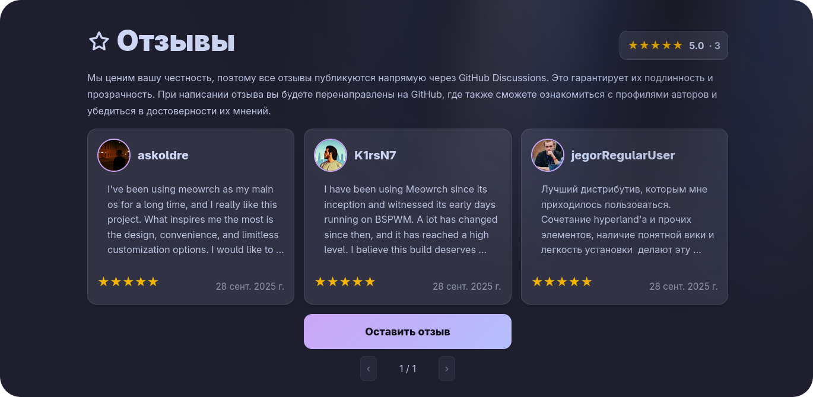

<div align="center">


# ≽ܫ≼ Meowrch

### *Arch Linux. Переосмысленный.*
**Где производительность встречается с эстетикой**

<br>

[](https://github.com/meowrch/meowrch/issues)
[](https://github.com/meowrch/meowrch/stargazers)
[](./LICENSE)


[](./README.ru.md)
[](./README.md)

<br>

[🚀 Быстрый старт](#-установка) • [📸 Галерея](#-визуальная-презентация) • [⚡ Возможности](#-почему-meowrch) • [📖 Wiki](https://meowrch.github.io/) • [💬 Сообщество](https://t.me/meowrch)

</div>

---

## 🎯 Зачем еще один дистрибутив?

<table>
<tr>
<td width="60%">

Arch Linux — это **свобода**. Но свобода **требует времени**.

Если ты хочешь Arch, но не хочешь тратить неделю на **dotfiles** — Meowrch делает это за тебя. 

CachyOS — производительность через глубокую оптимизацию.
EndeavourOS - чистый Arch с выбором DE, минимум преднастроек.
Manjaro - простота и стабильность через отложенные обновления.

**Meowrch** сочетает в себе **всё:**
- ⚡ **Максимальная производительность**: лучшие оптимизации из [ARU](https://github.com/ventureoo/ARU) и [CachyOS](https://cachyos.org/). [Подробнее](https://meowrch.github.io/ru/optimization/performance-advantages/)
- 🎨 **Готовое окружение**: BSPWM/Hyprland с темами, плавные анимации, функциональный **Dynamic Island**.
- 🛠️ **Установка за 10 минут**: от чистого Arch до полностью настроенного рабочего стола.

</td>
<td width="40%">

> [!NOTE]
> **"Arch для тех, кто ценит свое время"**

**В цифрах:**
- 🎯 **10 минут** до полной установки.
- 🚀 **2 полностью настроенных окружения** BSPWM + Hyprland.
- 🎨 **2 стандартные темы** + магазин тем **сообщества**.
- ⚙️ **1Gb RAM** при старте системы, благодаря [лёгким компонентам](https://meowrch.github.io/ru/introduction/component-selection-philosophy/).

</td>
</tr>
</table>

---

## 🌟 Почему Meowrch?

<div align="center">

| 💎 Особенность | 🔥 Что это дает вам |
|:---:|:---|
| **🚀 Оптимизация** | Система настроена с [агрессивными флагами оптимизации](https://meowrch.github.io/ru/optimization/performance-advantages/), проверенными сообществом. Производительность на уровне [CachyOS](https://cachyos.org/) |
| **🎨 Магазин тем [сообщества](https://github.com/meowrch/pawlette-themes)** | Меняй внешний вид всей системы **одной командой** |
| **📦 Open-source разработка** | Мы поддерживаем развитие Linux, разрабатывая собственные компоненты, **полезные мировому сообществу Linux**. [**Подробнее тут**](https://github.com/meowrch/) |
| **🛠️ Автоматизация** | Установка **за 10 минут**, полная настройка и оптимизация — **без ручной правки конфигов** |
| **🎯 Эргономика** | Горячие клавиши продуманы **до мелочей** — работай быстрее |
| **🌊 Два окружения** | BSPWM (X11) или Hyprland (Wayland) — **стабильность или современность** |

</div>

---

## 📸 Визуальная презентация

<table align="center">
  <tr>
    <td colspan="3">
        <a href="https://youtu.be/KdGPDF4p5CA">
            
        </a>
    </td>
  </tr>
  <tr>
    <td></td>
    <td></td>
    <td></td>
  </tr>
  <tr>
    <td></td>
    <td></td>
    <td></td>
  </tr>
</table>

---

## 🛠️ Установка

> [!WARNING] Установщик предназначен для **чистого Arch Linux**. \
> Если у вас уже настроенная система, установка **перезапишет** конфигурации. \
> Для тестирования создайте нового пользователя. 
> Если вам понравится — переходите на Meowrch полностью

### 📦 Быстрый старт

```
# 1. Клонируем репозиторий
git clone https://github.com/meowrch/meowrch --depth 1 --single-branch
cd meowrch

# 2. Запускаем установщик
sh install.sh

# 3. Перезагружаемся
reboot
```


## 📋 Что вы получаете после установки?

<table align="center">
<tr>
<th width="30%">Компонент</th>
<th width="70%">Детали</th>
</tr>
<tr>
<td><b>🐧 Базовая ОС</b></td>
<td><a href="https://archlinux.org/">Arch Linux</a> + <a href="https://meowrch.github.io/ru/optimization/performance-advantages/">агрессивная оптимизация</a>
</tr>
<tr>
<td><b>🪟 Оконные менеджеры</b></td>
<td><a href="https://github.com/baskerville/bspwm">BSPWM</a> (X11) | <a href="https://hyprland.org/">Hyprland</a> (Wayland)</td>
</tr>
<tr>
<td><b>📊 Панели</b></td>
<td><a href="https://github.com/polybar/polybar">Polybar</a> | <a href="https://github.com/Alexays/Waybar">Waybar</a> | <a href="https://github.com/meowrch/mewline">Mewline</a></td>
</tr>
<tr>
<td><b>🎨 Кастомизация</b></td>
<td><a href="https://github.com/meowrch/pawlette">Pawlette</a> с предустановленной темой Catppuccin Mocha</td>
</tr>
<tr>
<td><b>🖥️ Терминал</b></td>
<td><a href="https://github.com/kovidgoyal/kitty">Kitty</a></td>
</tr>
<tr>
<td><b>🐚 Оболочки</b></td>
<td><a href="https://github.com/fish-shell/fish-shell">Fish</a> | <a href="https://www.zsh.org">Zsh</a></td>
</tr>
<tr>
<td><b>🎯 Меню и виджеты</b></td>
<td><a href="https://github.com/davatorium/rofi">Rofi</a> | <a href="https://github.com/meowrch/mewline">Mewline</a></td>
</tr>
<tr>
<td><b>🔔 Уведомления</b></td>
<td><a href="https://github.com/dunst-project/dunst">Dunst</a> | <a href="https://github.com/ErikReider/SwayNotificationCenter">Swaync</a> | <a href="https://github.com/meowrch/mewline">Mewline</a></td>
</tr>
<tr>
<td><b>📦 Репозитории</b></td>
<td><a href="https://wiki.archlinux.org/title/Official_repositories">Arch Official</a> + <a href="https://aur.chaotic.cx/">Chaotic AUR</a></td>
</tr>
</table>

> [!NOTE]
> **Почему эти компоненты?**
> Мы выбирали между производительностью, функциональностью и стабильностью.
> [Подробнее о выборе компонентов](https://meowrch.github.io/ru/introduction/сomponent-selection-philosophy/)

---

## ⌨️ Горячие клавиши

| Действие                   | Комбинация     | Почему это удобно?                                                                                                              |
| -------------------------- | -------------- | ------------------------------------------------------------------------------------------------------------------------------- |
| Открыть терминал           | Super + Enter  | Быстрый доступ к универсальному инструменту.                                                                                    |
| Выбор приложения           | Super + A      | Удобный вариант выбора нужного приложения.                                                                                      |
| Цветовая пипетка           | Super + C      | Распознай цвет с экрана для дизайна/разработки.                                                                                 |
| Сменить обои               | Super + W      | Rofi с превью. Одна кнопка — новый вид рабочего стола.                                                                          |
| Сменить тему               | Super + T      | Новая тема за 2 секунды. Без редактирования конфигов.                                                                           |
| Эмодзи                     | Super + .      | Как в Windows 11, но быстрее.                                                                                                   |
| Отключить сочетания клавиш | Super + Escape | Может помочь в случаях использования виртуальных машин на Meowrch, с конфигурациями, работающими так-же через сочетания клавиш. |


> [!TIP] **Полный список:** \
> Все доступные сочетания клавиш вы можете найти [здесь](https://meowrch.github.io/ru/usage/hotkeys/#meowrch-hotkeys).

---

## 💬 Поддержка и сообщество

<div align="center">

<a href="https://meowrch.github.io/">

</a>

**[🌐 Официальная Wiki](https://meowrch.github.io/)** — гайды, FAQ, устранение проблем

<br>

### 💬 Присоединяйтесь к сообществу

<table align="center">
<tr>
<td align="center" width="33%">
<h3>📢 Telegram</h3>
<a href="https://t.me/meowrch">

</a>
<br><br>
Новости, обновления и <a href="https://t.me/meowrch/7">быстрая поддержка</a>
</td>
<td align="center" width="33%">
<h3>🐛 Issues</h3>
<a href="https://github.com/meowrch/meowrch/issues">

</a>
<br><br>
Сообщить о баге или предложить фичу
</td>
<td align="center" width="33%">
<h3>⭐ Reviews</h3>
<a href="https://meowrch.github.io/ru/#reviews">

</a>
<br><br>
Поделиться впечатлениями о дистрибутиве
</td>
</tr>
</table>

</div>

---

## ⭐ Что говорят пользователи?

<div align="center">

<a href="https://meowrch.github.io/ru/#reviews">

</a>

> [!IMPORTANT] **📢 Ваш отзыв важен!** \
>  Поделитесь опытом на **[сайте](https://meowrch.github.io/ru/#reviews)**

</div>

---

## ☕ Поддержать проект

<div align="center">

**Нравится Meowrch?** Помогите развитию проекта! 🚀

| 💎 Криптовалюта | 📬 Адрес |
|:---:|:---|
| **TON** | `UQB9qNTcAazAbFoeobeDPMML9MG73DUCAFTpVanQnLk3BHg3` |
| **Ethereum** | `0x56e8bf8Ec07b6F2d6aEdA7Bd8814DB5A72164b13` |
| **Bitcoin** | `bc1qt5urnw7esunf0v7e9az0jhatxrdd0smem98gdn` |
| **Tron** | `TBTZ5RRMfGQQ8Vpf8i5N8DZhNxSum2rzAs` |

<br>

*Каждый донат мотивирует продолжать развивать проект! ❤️*

</div>

---

## 📊 Статистика проекта


### ⭐ История звезд

<a href="https://star-history.com/#meowrch/meowrch&Date">
<picture>
<source media="(prefers-color-scheme: dark)" srcset="https://api.star-history.com/svg?repos=meowrch/meowrch&type=Date&theme=dark" />
<source media="(prefers-color-scheme: light)" srcset="https://api.star-history.com/svg?repos=meowrch/meowrch&type=Date" />

</picture>
</a>

### 📈 Активность репозитория


---

<div align="center">

**Сделано с ❤️ для Linux сообщества**

</div>
