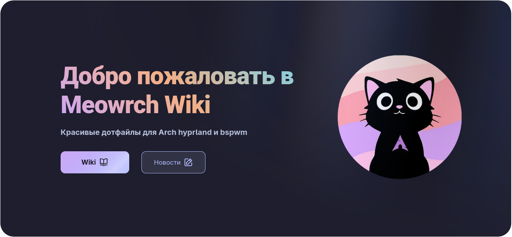
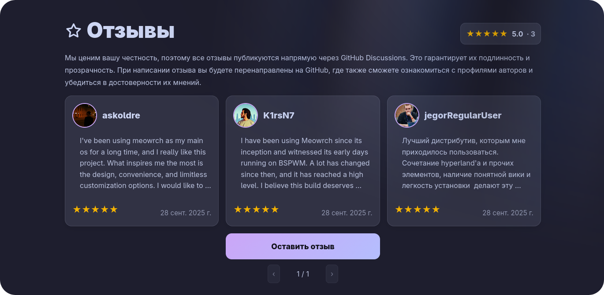

<div align="center">

<a href="https://meowrch.github.io/"></a>

# ≽ܫ≼ Meowrch

### *Arch Linux. Переосмысленный.*
**Где производительность встречается с эстетикой**

<br>

[](https://github.com/meowrch/meowrch/issues)
[](https://github.com/meowrch/meowrch/stargazers)
[](./LICENSE)


[](./README.ru.md)
[](./README.md)

<br>

[🚀 Установка](#установка) • [  NixOS версия](#альтернативные-установки) • [ MacBook версия](#альтернативные-установки)

[⚡ Возможности](#-почему-meowrch) • [📸 Галерея](#-визуальная-презентация) • [📖 Wiki](https://meowrch.github.io/en/)

[💬 Сообщество](https://t.me/meowrch)

</div>

---

## 🎯 Зачем ещё один Rice?

**Большинство готовых rice'ов для Arch решают только одну проблему:**

- Либо **красота**, но система жрёт RAM.
- Либо **производительность**, но UI выглядит убого.
- Либо **функциональность**, но код превращается в "спагетти", которые самостоятельно не поправить.

### **Meowrch — это другой подход:**

Мы не жертвуем одним ради другого. Вместо этого создаём систему, где каждый компонент выбран по принципу **"максимум результата при минимуме ресурсов"**.

**Но главное** — мы не ограничиваемся красивыми конфигами.

Мы создаём **собственные инструменты**, которые решают **многолетние боли всего Linux-сообщества**:
<table> 
  <tr> 
  <td>
🏷️ Nemo Tags

10+ лет сообщество просило систему тегов для Nemo.
Разработчики игнорировали. Мы сделали.

Теперь организация файлов как в macOS Finder — доступна каждому.
  </td> 
  </tr> 
  <tr> 
  <td>
🩸 BlueVein

Dual-boot Windows/Linux = ад с Bluetooth.
Переключил ОС? Заново подключай мышь, клавиатуру, наушники.
**Каждый. Раз.**

Мы решили эту терзающую проблему.
  </td> 
  </tr> 
</table>

> [!NOTE]
> **Все наши инструменты — open-source** и работают не только в Meowrch. \
> Мы развиваем экосистему **для всего Linux-сообщества**, а не просто "делаем красиво для себя".

---

## 🌟 Почему Meowrch?

<div align="center">

| Особенность | Что это дает вам |
|:---:|:---|
| **Оптимизация** | Система имеет лучшие оптимизации из [ARU](https://github.com/ventureoo/ARU) и [CachyOS](https://cachyos.org/). [Подробнее](https://meowrch.github.io/ru/optimization/performance-advantages/) |
| **Магазин тем [сообщества](https://github.com/meowrch/pawlette-themes)** | Меняй внешний вид всей системы **одной командой** |
| **Open-source разработка** | Мы поддерживаем развитие Linux, разрабатывая собственные компоненты, **полезные мировому сообществу Linux**. [**Подробнее тут**](https://github.com/meowrch/) |
| **Автоматизация** | Установка **за 10 минут**, полная настройка и оптимизация — **без ручной правки конфигов** |
| **Эргономика** | Горячие клавиши продуманы **до мелочей** — работай быстрее |
| **Два окружения** | BSPWM (X11) или Hyprland (Wayland) — **стабильность или современность** |
| **Легковесность** |  **1 GB RAM** при старте системы — благодаря [легковесным компонентам](https://meowrch.github.io/ru/introduction/сomponent-selection-philosophy/) |
</div>

---

## 📸 Визуальная презентация

<table align="center">
  <tr>
    <td colspan="3">
        <a href="https://youtu.be/ZZnBopmVzz4">
            
        </a>
    </td>
  </tr>
  <tr>
    <td></td>
    <td></td>
    <td></td>
  </tr>
  <tr>
    <td></td>
    <td></td>
    <td></td>
  </tr>
</table>

---

## 🏝️ Знакомьтесь: [Mewline](https://github.com/meowrch/mewline) — Dynamic Island для Linux

### **Компактный интерфейс, максимум информации:**

- **System tray** — все твои фоновые приложения
- **Workspaces** — быстрое переключение между рабочими столами
- **Date & Time** — всегда на виду
- **Brightness** — контроль яркости экрана
- **Volume** — управление звуком
- **Battery** — заряд и статус зарядки
- **Power** — меню управления питанием
- **OCR** — распознавание текста с выделенной области на экране.

### **Интерактивный центр управления системой:**

- **Compact mode** — информация об активном окне и играющей музыке
- **Information menu** — календарь и история уведомлений (Super+Alt+D)
- **App launcher** — запуск приложений (Super+Alt+A)
- **Wallpapers** — смена обоев с превью (Super+Alt+W)
- **Emoji picker** — выбор эмодзи (Super+Alt+.)
- **Clipboard** — история буфера обмена (Super+Alt+V)
- **Network manager** — Wi-Fi и Ethernet (Super+Alt+N)
- **Workspaces** — менеджер окон и воркспейсов (Super+Alt+Tab)
- **Bluetooth** — управление устройствами (Super+Alt+B)

> [!NOTE]
> Да-да. **Это всё — в одной утилите**. \
> Вместо настройки Rofi + Waybar + Dunst + wlogout + network-manager-applet + clipboard manager — **одна команда установки**.


<div align="center">

**[📖 Полная документация Mewline](https://github.com/meowrch/mewline)** -  **[🐛 Сообщить о проблеме](https://github.com/meowrch/mewline/issues)**

</div>

---

## <a name="установка"></a>🛠️ Установка

> [!WARNING] 
> Установщик предназначен для **чистого Arch Linux**. \
> Если у вас уже настроенная система, установка **перезапишет** конфигурации. \
> Для тестирования создайте нового пользователя. \
> Если вам понравится — переходите на Meowrch полностью

### 📦 Быстрый старт

```
# 1. Клонируем репозиторий
git clone https://github.com/meowrch/meowrch --depth 1 --single-branch
cd meowrch

# 2. Запускаем установщик
sh install.sh

# 3. Перезагружаемся
reboot
```

### <a name="альтернативные-установки"></a> 🌐 Альтернативные установки от сообщества 

Помимо стандартной установки на Arch Linux, сообщество Meowrch поддерживает следующие порты:

| Платформа | Описание | Репозиторий |
|:---|:---|:---|
|  **NixOS** | Полноценный порт Meowrch на NixOS с использованием home-manager и flakes | [NixOS-Meowrch](https://github.com/Redm00use/NixOS-Meowrch) |
|  **MacBook (Apple Silicon)** | Meowrch на Arch-based системе для MacBook M1 (через Asahi Linux) | [meowrch-asahi](https://github.com/Redm00use/meowrch-asahi) |
|  **MacBook + NixOS** | Meowrch на NixOS для MacBook M1 (через Asahi Linux) | [NixOS-Asahi-Kennel](https://github.com/Redm00use/NixOS-Asahi-Kennel) |

> [!WARNING]
> **Это неофициальные порты от сообщества.**  
> Данные репозитории поддерживаются энтузиастами и не входят в официальную кодовую базу Meowrch.  
> Мы не несём ответственности за их работоспособность, но приветствуем вклад сообщества в развитие экосистемы!

---

## 📋 Что вы получаете после установки?

<table align="center">
<tr>
<th width="30%">Компонент</th>
<th width="70%">Детали</th>
</tr>
<tr>
<td><b>🐧 Базовая ОС</b></td>
<td><a href="https://archlinux.org/">Arch Linux</a> + <a href="https://meowrch.github.io/ru/optimization/performance-advantages/">агрессивная оптимизация</a>
</tr>
<tr>
<td><b>🪟 Оконные менеджеры</b></td>
<td><a href="https://github.com/baskerville/bspwm">BSPWM</a> (X11) | <a href="https://hyprland.org/">Hyprland</a> (Wayland)</td>
</tr>
<tr>
<td><b>📊 Панели</b></td>
<td><a href="https://github.com/polybar/polybar">Polybar</a> | <a href="https://github.com/Alexays/Waybar">Waybar</a> | <a href="https://github.com/meowrch/mewline">Mewline</a></td>
</tr>
<tr>
<td><b>🎨 Кастомизация</b></td>
<td><a href="https://github.com/meowrch/pawlette">Pawlette</a> с предустановленной темой Catppuccin Mocha</td>
</tr>
<tr>
<td><b>🖥️ Терминал</b></td>
<td><a href="https://github.com/kovidgoyal/kitty">Kitty</a></td>
</tr>
<tr>
<td><b>🐚 Оболочки</b></td>
<td><a href="https://github.com/fish-shell/fish-shell">Fish</a> | <a href="https://www.zsh.org">Zsh</a></td>
</tr>
<tr>
<td><b>📱 Меню и виджеты</b></td>
<td><a href="https://github.com/davatorium/rofi">Rofi</a> | <a href="https://github.com/meowrch/mewline">Mewline</a></td>
</tr>
<tr>
<td><b>🔔 Уведомления</b></td>
<td><a href="https://github.com/dunst-project/dunst">Dunst</a> | <a href="https://github.com/ErikReider/SwayNotificationCenter">Swaync</a> | <a href="https://github.com/meowrch/mewline">Mewline</a></td>
</tr>
<tr>
<td><b>📦 Репозитории</b></td>
<td><a href="https://wiki.archlinux.org/title/Official_repositories">Arch Official</a> + <a href="https://aur.chaotic.cx/">Chaotic AUR</a></td>
</tr>
</table>

> [!NOTE]
> **Почему эти компоненты?**
> Мы выбирали между производительностью, функциональностью и стабильностью.
> [Подробнее о выборе компонентов](https://meowrch.github.io/ru/introduction/сomponent-selection-philosophy/)

---

## ⌨️ Горячие клавиши

| Действие                   | Комбинация     | Почему это удобно?                                                                                                              |
| -------------------------- | -------------- | ------------------------------------------------------------------------------------------------------------------------------- |
| Открыть терминал           | Super + Enter  | Быстрый доступ к универсальному инструменту.                                                                                    |
| Выбор приложения           | Super + A      | Удобный вариант выбора нужного приложения.                                                                                      |
| Цветовая пипетка           | Super + C      | Распознай цвет с экрана для дизайна/разработки.                                                                                 |
| Сменить обои               | Super + W      | Rofi с превью. Одна кнопка — новый вид рабочего стола.                                                                          |
| Сменить тему               | Super + T      | Новая тема за 2 секунды. Без редактирования конфигов.                                                                           |
| Эмодзи                     | Super + .      | Как в Windows 11, но быстрее.                                                                                                   |
| Отключить сочетания клавиш | Super + Escape | Может помочь в случаях использования виртуальных машин на Meowrch, с конфигурациями, работающими так-же через сочетания клавиш. |


> [!TIP]
> **Все доступные сочетания клавиш** вы можете найти [**здесь**](https://meowrch.github.io/ru/meowrch-base/hotkeys/meowrch-hotkeys/).

---

## 💬 Поддержка и сообщество

<div align="center">

<a href="https://meowrch.github.io/">

</a>

**[🌐 Официальная Wiki](https://meowrch.github.io/)** — гайды, FAQ, устранение проблем

[](https://deepwiki.com/meowrch/meowrch)

<br>

### 💬 Присоединяйтесь к сообществу

<table align="center">
<tr>
<td align="center" width="33%">
<h3>📢 Социальные сети</h3>
<a href="https://t.me/meowrch">

</a>
<a href="https://x.com/me0wrch">

</a>
<br><br>
Новости, обновления и <a href="https://t.me/meowrch/7">быстрая поддержка</a>
</td>
<td align="center" width="33%">
<h3>🐛 Проблемы</h3>
<a href="https://github.com/meowrch/meowrch/issues">

</a>
<br><br>
Сообщить о баге или предложить фичу
</td>
<td align="center" width="33%">
<h3>⭐ Отзывы</h3>
<a href="https://meowrch.github.io/ru/#reviews">

</a>
<br><br>
Поделиться впечатлениями о дистрибутиве
</td>
</tr>
</table>

</div>

---

## ⭐ Что говорят пользователи?

<div align="center">

<a href="https://meowrch.github.io/ru/#reviews">

</a>
<br>
<br>
</div>


> [!IMPORTANT] 
> **📢 Ваш отзыв важен!** \
>  Поделитесь опытом на **[сайте](https://meowrch.github.io/ru/#reviews)**

---

## ☕ Поддержать проект

<div align="center">

| 💎 Криптовалюта | 📬 Адрес |
|:---:|:---|
| **TON** | `UQB9qNTcAazAbFoeobeDPMML9MG73DUCAFTpVanQnLk3BHg3` |
| **Ethereum** | `0x56e8bf8Ec07b6F2d6aEdA7Bd8814DB5A72164b13` |
| **Bitcoin** | `bc1qt5urnw7esunf0v7e9az0jhatxrdd0smem98gdn` |
| **Tron** | `TBTZ5RRMfGQQ8Vpf8i5N8DZhNxSum2rzAs` |

</div>

---

## 📊 Статистика проекта

<a href="https://star-history.com/#meowrch/meowrch&Date">
<picture>
<source media="(prefers-color-scheme: dark)" srcset="https://api.star-history.com/svg?repos=meowrch/meowrch&type=Date&theme=dark" />
<source media="(prefers-color-scheme: light)" srcset="https://api.star-history.com/svg?repos=meowrch/meowrch&type=Date" />

</picture>
</a>

---

<div align="center">

**Сделано с ❤️ для Linux сообщества**

</div>
